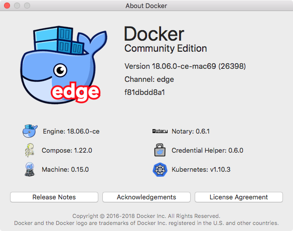
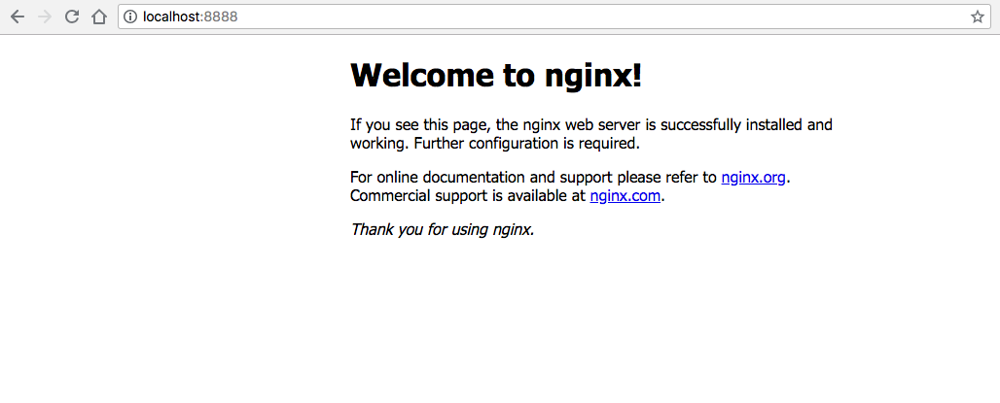
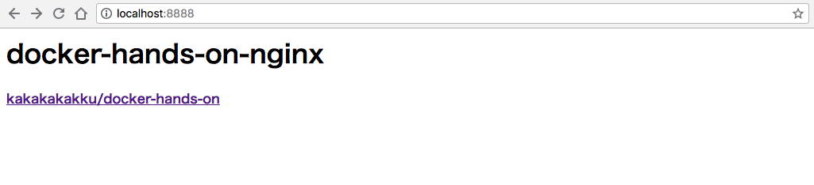
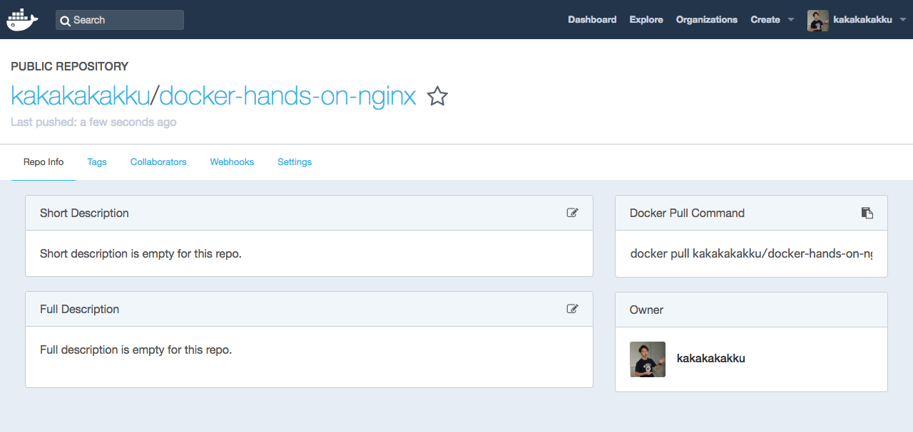

# docker-hands-on

[](https://github.com/kakakakakku/docker-hands-on/stargazers)

## 前提

Docker ハンズオン資料は以下の環境を前提に動作確認をしています．

- [Docker Community Edition for Mac](https://store.docker.com/editions/community/docker-ce-desktop-mac)

## 環境準備

Docker Community Edition をインストールします．バージョンは最新にします．



インストール後に `docker` コマンドを実行できるようになっていれば，正常にインストールできています．

```sh
$ which docker
/usr/local/bin/docker

$ docker -v
Docker version 18.06.0-ce, build 0ffa825

$ docker info
```

## `hello-world` コンテナを実行する

Docker Community Edition の動作確認も兼ねて，さっそくコンテナを実行してみましょう．今回は Docker から公式に提供されている `hello-world` イメージを使います．

- [library/hello-world - Docker Hub](https://hub.docker.com/_/hello-world/)

以下のように `docker run hello-world` と実行します．`docker run` は指定したイメージを実行するコマンドです．`Hello from Docker!` と表示されていれば，正常に実行できています．

```sh
$ docker run hello-world

Unable to find image 'hello-world:latest' locally
latest: Pulling from library/hello-world
9db2ca6ccae0: Pull complete
（中略）

Hello from Docker!
This message shows that your installation appears to be working correctly.

（中略）
```

次に `docker imeges` と実行します．ダウンロードしたイメージを確認することができます．今回使った `hello-world` イメージはたった `1.85kB` と非常に軽量です．

```sh
$ docker image ls
REPOSITORY                            TAG                 IMAGE ID            CREATED             SIZE
hello-world                           latest              2cb0d9787c4d        5 weeks ago         1.85kB
```

## `nginx` コンテナを実行する

もう少し実践的なコンテナを実行してみましょう．次は nginx 公式の `nginx` イメージを使います．

- [library/nginx - Docker Hub](https://hub.docker.com/r/library/nginx/)

少しオプションが増えました．`-d` はコンテナプロセスをバックグラウンド実行する場合に指定します．`-p` はコンテナ内部のポートに接続する場合に指定します．今回は動作環境の `8888` ポートをコンテナ内部の `80` ポートに接続しています．

```sh
$ docker run -d -p 8888:80 nginx

Unable to find image 'nginx:latest' locally
latest: Pulling from library/nginx
be8881be8156: Pull complete
32d9726baeef: Pull complete
87e5e6f71297: Pull complete
（中略）
```

さっそく `http://localhost:8888/` に接続してみましょう．すると nginx に接続できます．



次に `docker container ls` と実行します．`docker container ls` は実行中のコンテナを一覧するコマンドです．続けて `docker container kill` と実行し，コンテナを停止します．すると nginx に接続できなくなります．

```sh
$ docker container ls
CONTAINER ID        IMAGE               COMMAND                  CREATED             STATUS              PORTS                  NAMES
3185885edcfb        nginx               "nginx -g 'daemon of…"   8 minutes ago       Up 8 minutes        0.0.0.0:8888->80/tcp   relaxed_shaw

$ docker container kill 3185885edcfb
3185885edcfb
```

## `nginx` コンテナをカスタマイズする

次に `nginx` イメージをベースにカスタマイズをしてみましょう．具体的には任意の `index.html` を追加したイメージを作成します．

まず，任意のディレクトリに kakakakakku/docker-hands-on リポジトリをクローンしましょう．事前に `dockerfiles/nginx` ディレクトリに `Dockerfile` と `index.html` を用意しています．`Dockerfile` はイメージの構築手順を記述したファイルです．`index.html` は今回 nginx に読み込ませるファイルです．

```sh
$ git clone https://github.com/kakakakakku/docker-hands-on.git
$ cd docker-hands-on
$ ls -l dockerfiles/nginx
```

`Dockerfile` は非常にシンプルです．先ほど動作確認をした `nginx` イメージをベースに `index.html` をコンテナ内部の `/usr/share/nginx/html/index.html` に配置しています．`COPY` はローカルからコンテナ内部にファイルをコピーするときに使います．

```
FROM nginx

COPY ./index.html /usr/share/nginx/html/index.html
```

さっそくイメージをビルドしてみましょう．以下のように `docker build` コマンドを実行します．今回は `docker-hands-on-nginx` というコンテナ名にしましょう．すぐにイメージが作成できます．

```sh
$ docker build -t docker-hands-on-nginx dockerfiles/nginx/
（中略）
Successfully tagged docker-hands-on-nginx:latest

$ docker image ls
REPOSITORY                            TAG                 IMAGE ID            CREATED             SIZE
docker-hands-on-nginx                 latest              e5c40748c226        27 hours ago        109MB
```

カスタマイズしたイメージをすぐに実行できます．先ほどと同じ `docker run` コマンドを実行しましょう．

```sh
$ docker run -d -p 8888:80 docker-hands-on-nginx
```

改めて `http://localhost:8888/` に接続すると，カスタマイズした `index.html` を確認できます．



## Docker Hub にイメージを公開する

作成した `docker-hands-on-nginx` イメージを Docker Hub に公開しましょう．最初に Docker Hub でアカウントを取得します．

- [Docker Hub](https://hub.docker.com/)
- [kakakakakku - Docker Hub](https://hub.docker.com/u/kakakakakku/)

取得したアカウントを環境変数に設定します（ハンズオン資料として手順を共通化するためです）．

```sh
$ export DOCKER_HUB_ACCOUNT=xxxxxxxxxx
$ echo ${DOCKER_HUB_ACCOUNT}
```

次に Docker Hub にログインをします．

```sh
$ docker login
（中略）
Login Succeeded
```

次にイメージを Docker Hub に公開します．今回は `docker tag` コマンドでイメージ名にアカウント名を追加し，`docker push` で Docker Hub に公開しています．

```sh
$ docker tag docker-hands-on-nginx ${DOCKER_HUB_ACCOUNT}/docker-hands-on-nginx

$ docker push ${DOCKER_HUB_ACCOUNT}/docker-hands-on-nginx
```

自分の Docker Hub を確認すると，以下のように正常にイメージが公開できています．



## Docker Compose で複数コンテナを実行する

Docker Compose を使うと，複数コンテナを実行することができます．Docker Compose の設定ファイルは `dockerfiles/composetest/docker-compose.yml` です．以下のような構成になり，`services` 直下を見ると `web` コンテナと `redis` コンテナを実行していることがわかります．

```yaml
version: '3'
services:
  web:
    build: .
    ports:
     - "5000:5000"
  redis:
    image: "redis:alpine"
```

さっそく実行してみましょう．Docker Composer では `docker-compose up` コマンドを実行します．

```sh
$ docker-compose -f dockerfiles/composetest/docker-compose.yml up -d
Starting composetest_redis_1 ... done
Starting composetest_web_1   ... done
```

そして `http://0.0.0.0:5000/` に接続してみましょう．ブラウザをリロードすると，アクセス回数をカウントするアプリケーションを簡単に実行することができました．


アクセス回数のデータはどこに保存されているのでしょう？実行中の `redis` コンテナに接続してみましょう．

まず `docker ps` コマンドで実行中のコンテナ一覧を確認します（`CONTAINER ID` は異なります）．次に `docker exec` コマンドで `redis` コンテナに接続をします．コンテナ内部で Redis に接続し，保存されている `hits` キーの値を確認することができます．このように `docker exec` コマンドを使うとコンテナに接続することができます．

```sh
$ docker ps
CONTAINER ID        IMAGE               COMMAND                  CREATED             STATUS              PORTS                    NAMES
1fc29424e6d0        composetest_web     "python app.py"          14 minutes ago      Up 14 minutes       0.0.0.0:5000->5000/tcp   composetest_web_1
f20f5ec95f34        redis:alpine        "docker-entrypoint.s…"   14 minutes ago      Up 14 minutes       6379/tcp                 composetest_redis_1

$ docker exec -it f20f5ec95f34 /bin/sh

/data # redis-cli

127.0.0.1:6379> GET hits
"10"
127.0.0.1:6379> quit
```

動作確認後は Docker Composer を停止しておきましょう．

```sh
$ docker-compose -f dockerfiles/composetest/docker-compose.yml stop
Stopping composetest_web_1   ... done
Stopping composetest_redis_1 ... done
```
